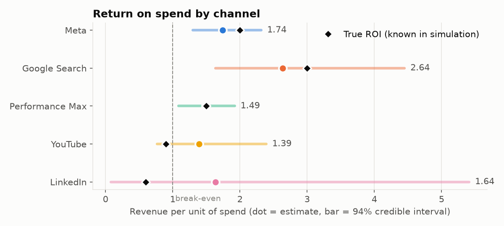
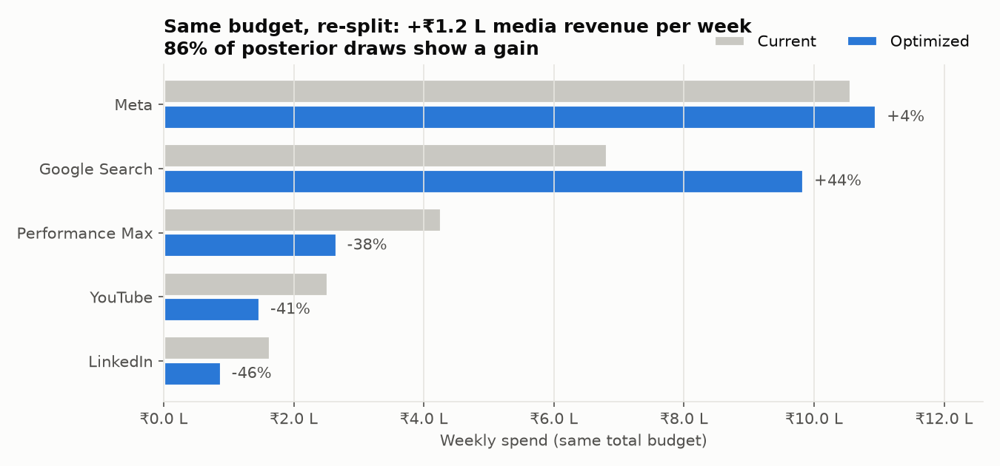
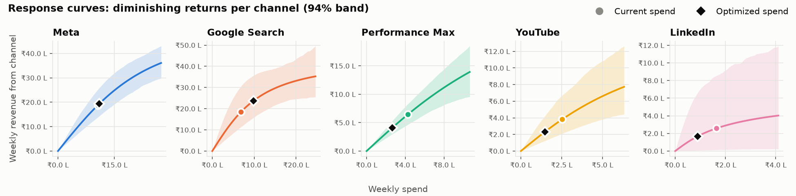
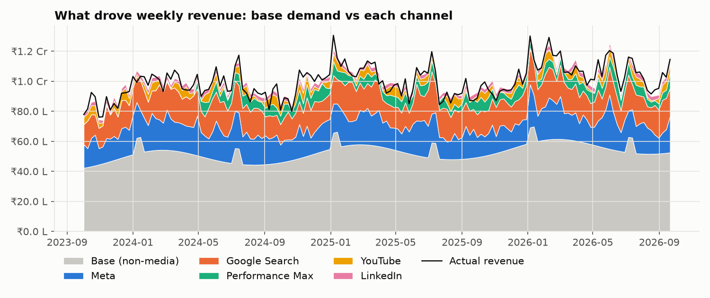
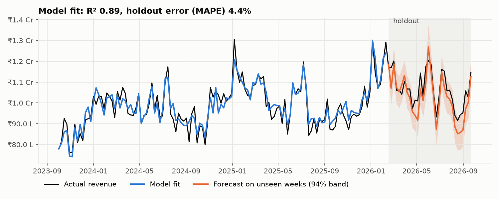

# Marketing Mix Model & Budget Optimizer

**Which marketing channels actually drive revenue, and how should the same budget be split to earn more?**

A Bayesian marketing mix model (MMM) built with [PyMC-Marketing](https://www.pymc-marketing.io/). It estimates each channel's return on spend from weekly aggregate data, with no user-level tracking or cookies. It then uses those estimates to recommend a better budget split, and reports how confident that recommendation is.

▶ **Live demo:** _add your Streamlit link here_

---

## Results at a glance

| | Meta Robyn benchmark (public) | Indian ed-tech mix (simulated) |
|---|---|---|
| Weeks of data | 208 | 156 |
| Fit (R²) | 0.90 | 0.89 |
| Error on unseen holdout weeks (MAPE) | 9.0% | 4.3% |
| Sampler health | max R-hat 1.004, 0 divergences | max R-hat 1.006, 9 divergences out of 4,000 draws |
| Same budget, re-split | **+20% media revenue/week** (97% probability of a gain) | **+2.4% media revenue/week** (86% probability) |
| True ROI recovered? | n/a (truth unknown) | **5 of 5 channels inside the 94% interval** |

### Validation against known truth
The ed-tech dataset was generated from adstock, saturation and ROI values I chose, so the model's estimates can be checked against the real answer:

| Channel | Share of spend | True ROI | Estimated ROI (94% interval) | Error |
|---|---|---|---|---|
| Meta | 42% | 2.00 | 1.74 (1.30–2.32) | −13% |
| Google Search | 27% | 3.00 | 2.64 (1.63–4.45) | −12% |
| Performance Max | 14% | 1.50 | 1.49 (1.09–1.92) | −0.5% |
| YouTube | 10% | 0.90 | 1.39 (0.77–2.39) | +55% |
| LinkedIn | 6% | 0.60 | 1.64 (0.08–5.41) | +173% |

The big channels are recovered within about 13%. The small channels have wide intervals, so the model is uncertain about them and says so. In practice, this is where you would run a geo-lift or conversion-lift test, then feed the result back into the model as a prior.

Scored against the **true** response curves, the model's recommended plan earns **₹1.89 L more per week (about ₹98 L a year)**. That is 72% of the gain from the best plan possible with perfect knowledge.

---

## Charts

**Return on spend by channel.** Dot = estimate, bar = 94% credible interval, ◆ = true value.


**Recommended re-split of the same weekly budget**


**Response curves.** Diminishing returns explain why moving money between channels helps.


**What drove revenue each week**


**Fit and out-of-sample forecast**


The same five charts for the Robyn benchmark are in [`outputs/robyn/`](outputs/robyn/). The headline there is that Outdoor's ROI is below break-even (0.44, interval 0.02–1.24). The plan cuts Outdoor by 50% and Search by 30%, and moves the money into TV, Print and Facebook.

---

## How it works

1. **Adstock (carryover):** an ad keeps working for weeks after it runs. A geometric decay is fitted for each channel, up to 8 weeks.
2. **Saturation (diminishing returns):** each extra rupee in a channel earns less than the one before. A logistic curve is fitted for each channel.
3. **Bayesian regression:** revenue = base + trend + yearly seasonality + controls + Σ channel effects. It is fitted with MCMC (4 chains × 1,000 draws), so every number comes with a credible interval.
   - Controls for Robyn: competitor sales, newsletter and German public holidays. The data is German, and holiday weeks were the model's largest errors until they were added.
   - Controls for ed-tech: fee-discount offer weeks.
4. **Validation:**
   - Fit on the first 80% of weeks and forecast the last 20%.
   - Check convergence (R-hat, effective sample size, divergences).
   - Confirm the hand-written NumPy transforms reproduce the model's channel contributions exactly.
   - On the simulated data, compare against the true values.
5. **Budget optimizer:** maximise expected media revenue for a fixed weekly budget using SciPy's SLSQP solver.
   - Each channel stays between 50% and 150% of its current spend, and never above its largest historical week, so the model doesn't extrapolate beyond what it has seen.
   - The plan is scored on all 1,000 posterior draws, which gives the probability of a gain.
6. **Streamlit app:** change the total budget and the limit on each channel to see the recommended split, the marginal ROI per channel and the expected uplift. It runs on the saved posterior draws, so it needs no PyMC at runtime.

## Project structure
```
├── app.py                  Streamlit budget simulator
├── run_all.sh              rebuild everything end to end
├── src/
│   ├── prepare_data.py     downloads Robyn data, simulates the ed-tech dataset
│   ├── transforms.py       adstock / saturation / response maths (NumPy)
│   ├── fit_mmm.py          holdout check, full fit, ROI, decomposition, diagnostics
│   ├── optimizer.py        budget optimisation with posterior uncertainty
│   └── report.py           charts
├── data/                   modelling datasets + true parameters for the simulation
└── outputs/{robyn,edtech}/ metrics, ROI tables, budget plans, posterior draws, charts
```

## Run it
```bash
python -m venv .venv && source .venv/bin/activate
pip install -r requirements-model.txt
./run_all.sh                # ~1-2 min: data → fit → optimise → charts
streamlit run app.py
```
To run the app only, `pip install -r requirements.txt` is enough.

## Limitations
- MMM estimates are correlational. Channels whose spend always moves together, or that are a small share of spend, are hard to separate. That's why YouTube and LinkedIn have wide intervals. Lift tests are the fix.
- The optimizer assumes a steady weekly spend level. It does not plan flighting, such as bursts versus always-on.
- The Robyn dataset is itself simulated by Meta, and the ed-tech dataset is fully synthetic. Neither contains real company data.

## Data sources
- Meta Robyn demo data: `dt_simulated_weekly` from [facebookexperimental/Robyn](https://github.com/facebookexperimental/Robyn) (MIT licence).
- Ed-tech data: generated by `src/prepare_data.py` with a fixed seed. True parameters are in `data/edtech_true_params.json`.
